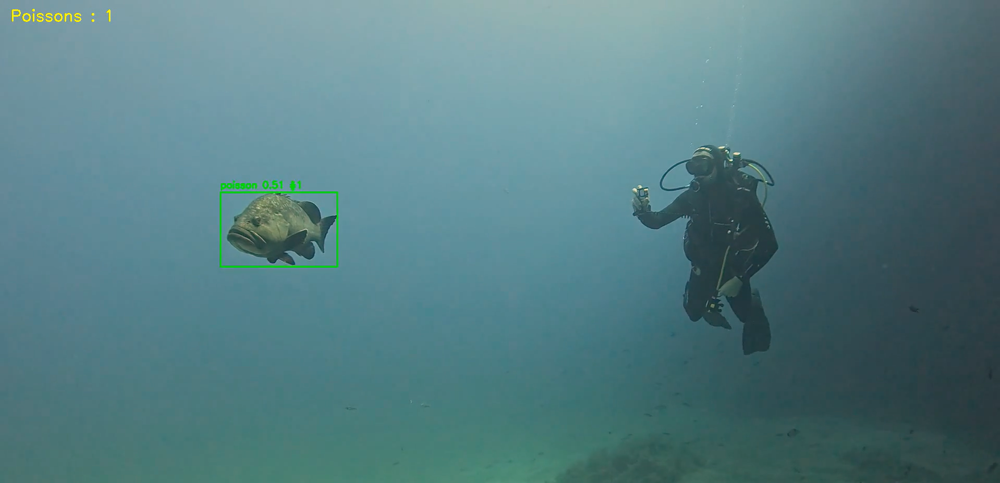

# Détecteur de faune marine du port

[](https://github.com/Gautier396/port-fauna-detector/actions/workflows/ci.yml)



Détection de poissons dans des vidéos de plongée GoPro filmées en
Méditerranée, avec suivi multi-objet (ByteTrack) pour des IDs stables d'une
frame à l'autre.

Vidéos et photos de plongée : Vincent Bardinal.

Le projet a deux volets :

1. **BGLE-YOLO** — reconstruction "from scratch" d'une architecture de
   détection légère spécialisée sous-marin, à partir de sa description
   publiée (pas de code officiel disponible). C'est le cœur technique du
   projet.
2. **Un benchmark YOLOv8** entraîné sur les mêmes données, utilisé comme
   point de comparaison pour évaluer BGLE-YOLO.

## Résultats

| | mAP50-95 | Précision | Rappel |
|---|---|---|---|
| YOLOv8s (`portfauna_v3`, référence) | 0.130 | 0.398 | 0.351 |
| BGLE-YOLO (meilleure époque) | 0.118 | 0.375 | 0.337 |

BGLE-YOLO n'a pas encore rattrapé le benchmark, avec deux réserves : il part
d'une initialisation aléatoire (aucun poids pré-entraîné n'existe pour cette
architecture, contrairement à YOLOv8 pré-entraîné sur COCO), et son
entraînement s'est arrêté avant la fin du schedule de taux d'apprentissage
prévu.

## Démos vidéo

BGLE-YOLO et YOLOv8 sur la même vidéo source :

<video src="docs/demo-bgle.mp4" controls width="480"></video>
<video src="docs/demo-yolov8.mp4" controls width="480"></video>

Vidéo source : chaîne YouTube [UCLDsTtyfNNWudB6p48LfIMA](https://www.youtube.com/channel/UCLDsTtyfNNWudB6p48LfIMA).

YOLOv8 sur une plongée réelle :

<video src="docs/demo2-yolov8.mp4" controls width="480"></video>

Vidéo source : Vincent Bardinal.

## BGLE-YOLO

Reconstruction "best-effort" de l'architecture décrite dans Zhao et al.,
*"BGLE-YOLO: A Lightweight Model for Underwater Bio-Detection"* (2025) — les
auteurs ne partagent pas leur code. L'implémentation ci-dessous suit l'esprit
de chaque module décrit dans le papier (convolution multi-échelle, attention
globale/locale, convolution à différences reparamétrée, tête légère à poids
partagés), sans être une reproduction exacte : certains détails (ratios de
canaux, nombre de répétitions) ne sont pas spécifiés dans le papier et ont
été choisis raisonnablement.

Basée sur un squelette YOLOv8s (échelle `s`), nc=1 (poisson), ~14.2M
paramètres.

**Backbone — EMC (Efficient Multi-Scale Convolution)** : module à canaux
préservés inséré après chaque bloc C2f. La moitié des canaux passe sans
convolution ; l'autre moitié est traitée en parallèle par des noyaux 3×3 et
5×5, fusionnés par une convolution 1×1.

**Neck — GLSA (Global-to-Local Spatial Aggregation)** : combine une
attention globale (self-attention sur la carte de features aplatie) et une
attention locale (convolution séparable depthwise), fusionnées par une
convolution 1×1. Insérée après chaque bloc C2f du neck FPN/PAN.

**Tête — LSHDetect (Lightweight Shared Head)** : la branche de régression de
boîte partage ses poids entre les trois échelles (P3/P4/P5), avec un
alignement de canaux par 1×1 en amont pour rendre ce partage possible malgré
les canaux différents à chaque échelle ; la branche de classification garde
des poids séparés par échelle. Les convolutions internes utilisent
**DEConv** (Detail-Enhanced Convolution) : un poids de base combiné à quatre
variantes de différence (centrale, horizontale, verticale, angulaire),
reparamétrées en un seul noyau effectif — un unique appel `conv2d` à
l'inférence, sans coût additionnel. Les termes de différence sont atténués
par un facteur `θ=0.2` avant d'être ajoutés au poids de base ; sans cette
atténuation, l'entraînement diverge (pertes NaN après une vingtaine
d'époques).

Code : `src/nn/bgle_modules.py` (modules), `src/nn/register.py`
(enregistrement auprès d'ultralytics), `configs/bgle_yolo.yaml` (assemblage).

## Jeu de données

[SFISHTRACK](https://doi.org/10.1038/s41597-026-07786-z) — vidéos
sous-marines annotées (boîtes englobantes, segmentation, suivi multi-objet),
collectées en mer Baléare :

> Sanchez, J., Lisani, J.L., Catalan, I.A. et al. *A Dataset for Fish
> Segmentation and Tracking in Underwater Videos.* Scientific Data 13, 1181
> (2026). https://doi.org/10.1038/s41597-026-07786-z

54 vidéos, 23 233 images, 147 582 boîtes converties en labels YOLO
(`src/convert_sfishtrack.py`). Le jeu est mono-classe (poisson) : les
catégories COCO du dataset ne distinguent pas les espèces.

Un prétraitement de balance des blancs gray-world (`src/preprocess.py`)
corrige la dominante bleu/vert de l'eau, appliqué de façon identique au
dataset d'entraînement et à chaque frame vidéo à l'inférence.

## Structure

```
src/
  nn/bgle_modules.py      architecture BGLE-YOLO (EMC, GLSA, LSHDetect, DEConv)
  nn/register.py          enregistrement des modules custom auprès d'ultralytics
  convert_sfishtrack.py   annotations COCO SFISHTRACK -> labels YOLO
  preprocess.py           correction couleur sous-marine
  train.py                entraînement (YOLOv8 ou BGLE-YOLO selon --model)
configs/
  bgle_yolo.yaml           assemblage du modèle BGLE-YOLO
  data_sfishtrack.yaml      config ultralytics générée par convert_sfishtrack.py
  species.yaml              nomenclature active (classes réellement peuplées)
docs/
  species_roadmap.yaml      nomenclature cible à 27 classes (vision long terme, non chargée par le code)
  demo.png, demo*.mp4       images/vidéos utilisées dans ce README (cf. Licence pour les crédits)
tests/
  test_smoke.py             tests sans dataset ni GPU (CI)
app.py                      démo Gradio : détection + suivi + comptage (port 7860)
view_labels.py               revue des labels générés (port 7862)
```

## Installation

```bash
pip install -r requirements.txt
```

## Utilisation

```bash
# Conversion du dataset SFISHTRACK
python src/convert_sfishtrack.py --dataset-root data/external/sfishtrack/SFISHTRACK --output data/sfishtrack

# Entraînement — benchmark YOLOv8
python -m src.train --data configs/data_sfishtrack.yaml --model yolov8s.pt --name portfauna_v3

# Entraînement — BGLE-YOLO
python -m src.train --data configs/data_sfishtrack.yaml --model configs/bgle_yolo.yaml --name portfauna_bgle
python -m src.train --name portfauna_bgle --resume   # reprise après interruption

# Démo glisser-déposer
python app.py

# Tests (rapides, sans dataset ni GPU)
pytest tests/
```

## Licence

Ce projet dépend d'[Ultralytics YOLO](https://github.com/ultralytics/ultralytics),
distribué sous licence **AGPL-3.0**. En l'absence de licence Enterprise
Ultralytics, ce dépôt est donc lui-même publié sous **AGPL-3.0** (voir
[`LICENSE`](LICENSE)) — toute utilisation, modification ou mise à
disposition en réseau (y compris `app.py`) est soumise aux termes de cette
licence, notamment l'obligation de rendre le code source disponible.

BGLE-YOLO est une réimplémentation indépendante inspirée de la description
publiée par Zhao et al. (2025) ; elle n'utilise ni le code ni les poids des
auteurs originaux, qui ne sont pas publics. Le jeu de données SFISHTRACK est
utilisé conformément à sa publication (Sanchez et al., 2026, voir
ci-dessus) ; se référer à sa source pour les conditions d'utilisation
propres au dataset.

Vidéos et photos utilisées pour la démo et les tests (hors SFISHTRACK) :
Vincent Bardinal (image et vidéo de démo principales, `docs/demo.png`,
`docs/demo2-yolov8.mp4`), tous droits réservés ; chaîne YouTube
[UCLDsTtyfNNWudB6p48LfIMA](https://www.youtube.com/channel/UCLDsTtyfNNWudB6p48LfIMA)
(`docs/demo-bgle.mp4`, `docs/demo-yolov8.mp4`), droits de l'auteur d'origine.

## Points ouverts

- BGLE-YOLO n'a pas terminé son schedule d'entraînement complet.
- La nomenclature cible à 27 classes (`docs/species_roadmap.yaml`) n'a
  aucune source de données active pour l'instant : SFISHTRACK est mono-classe.

## Pistes futures

**Comptage de poissons** : `app.py` a eu un compteur par vidéo (agrégation
des IDs ByteTrack distincts), retiré depuis. Un comptage brut d'IDs de
tracking a une limite connue : un ID change si un poisson sort du cadre
puis revient, gonflant artificiellement le compte — à prendre en compte
dans une future implémentation plutôt que de recompter naïvement les IDs.

**Registre d'individus inter-vidéos** : au-delà d'un comptage par vidéo,
une piste explorée puis mise de côté consiste à dédupliquer les individus
revus d'une plongée à l'autre — embedding visuel par crop détecté (ex.
ResNet18), registre persistant avec appariement par similarité cosinus
(restreint à une fenêtre temporelle plausible), et une file de vérification
manuelle pour les détections à confiance trop faible pour être enregistrées
automatiquement. Non implémentée actuellement ; à reprendre si le comptage
inter-plongées devient un besoin réel (le même problème de fiabilité des
IDs ByteTrack s'appliquerait au sein de chaque vidéo).

**Géolocalisation par observation** : besoin identifié tôt dans le projet
(GPS/EXIF par détection, pour situer chaque observation dans le port plutôt
que seulement par vidéo) puis mis de côté, expérimental. Naturellement liée
au registre d'individus ci-dessus si les deux sont repris ensemble — sans
GPS, un individu ne peut être situé que par la vidéo/le timestamp qui l'a
capturé, pas par sa position réelle.
